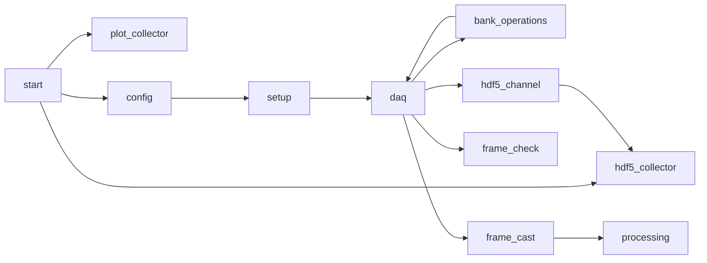

# QuantiCam Julia API

- [X] Calls to safe OpalKelly.jl bindings to the FrontPanel API
- [X] Plots using Makie
- [X] Save datasets in HDF5 files with date and description annotation

## Operation pipeline

## HDF5 view

You can view the datasets by loading the data and display it as you wish, or use
[dataviewer](https://github.com/triscale-innov/DataViewer.jl)

## QuantiCam interface description

The QuantiCam description of the sensor functionality is described in the paper @6AFTWQX9#Henderson_Etal-2019. This shows the SPAD front-end gating for single-photon count (SPC) and time-correlated single-photon count (TCPSC), the pseudo-differential ring oscillator (PRVCO/GRO) implemented with the level-shifters necessary to quantize the TDC fine codes and finally the ripple counter used for coarse TCPSC or generally SPC counting.

The read-out of the sensor is done for each row-pair sequentially through the
parrallel-input serial-output interface of the chip (top and bottom rows) which
gobble 4 columns together in a PISO line. Therefore there are 32 + 32 PISO lines
for top and bottom, each serialising 4 columns of 14 bits each (56 bits).

The coding scheme for the each PISO 14-bits readout is:

| Field | $F_3$,$\overline{F_2}$,$F_1$,$\overline{F_0}$ | SPADWIN | C0 | C8,1 | 
| - | - |   - |  - |  - | 
| Bits | 13:10 | 9 | 8 | 7:0 |

Default {$F_3$,$F_2$,$F_1$,$F_2$} when TDC is reset is: `0110`, so the received
encoding is {$F_3$,$\overline{F_2}$,$F_1$,$\overline{F_0}$}=`0011` 

> [!WARN]
> The initialized value extracted from the paper doesn't make sense, it should be `1010`
> but it does match with the observed code for untriggered SPADS: 0x04 fine code

The flags enconding from the ring-oscillator for the fine counting are then decoded in unsigned representation:
| $\overline{F_0}$,$F_1$,$\overline{F_2}$,$F_3$ | Fine decoded | 2's complement |
|:----:|:-----:|:----:|
| 0111 | 111 | 001 |
| 0011 | 110 | 010 |
| 0001 | 101 | 011 |
| 0000 | 100 | 100 |
| 1000 | 011 | 101 |
| 1100 | 010 | 110 |
| 1110 | 001 | 111 |
| 1111 | 000 | 000 |

The coarse counter is incremented on the falling edge of $F_3$

This is then converted for the SPC and TCPSC modes with varying encoding based
on the byte_mode selected:

1. Full readout
    - SPC:
        | 15:9 | 8:0 |
        | - | - |
        | HEADER\[6:0\] | {C8,1, SPADWIN} | 
    - TCSPC:
        | 15:12 | 11:3 | 2:0 |
        | - | - | - |
        | HEADER\[2:0\] | {C8,1, C0} | fine decoded |
2. Byte select
    - SPC:
        | byte_select_msb | 7:0 |
        | - | - |
        | 0 | {C7,1, SPADWIN} | 
        | 1 | C8,1 | 
    - TCSPC:
        | 7:3 | 2:0 |
        | - | - |
        | {C4,1, C0} | fine decoded |

> [!WARN]
> Measurement as 2's complement inversion seems to happen twice, both on FW and
> SW side 

### Understanding more

- [ ] Vary delay and observe histogram shifting
- [ ] Vary gate_width to observe multiple peaks or only one peak
- [ ] Double check that the raw readout for 16-bits mode is interleaved {col4,
col3, col2, col1, 0 (FIFO empty)}, then make a strategy to fixup the
backpressure on the FIFO
- [X] Check trigger in aggregation that could fixup the 16-bits mode issue
    - The FrontPanel API triggers one bit at a time, so this can't be the cause

### Workaround for now
Duplicate logic from the MATLAB code into Julia, but fix it up eventually by
fixing the logic in the FW.

## Calibration

- [ ] Extract Vddro-> TDC resolution from the paper in a tabular form; There are
  tools to visually extract such information from papers, USE ONE. This gives
the general trend, but per pixel calibration still needs to be performed.
- [ ] Expand the beam and center it on the sensor to produce a uniform time
distribution illumination over the sensor region. => Tweak frequencies to result
in a uniform peak extraction.
- [ ] Calibrate frequency based on different delays used
